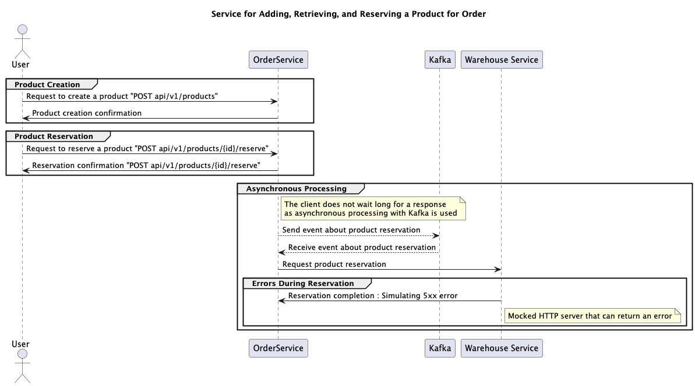
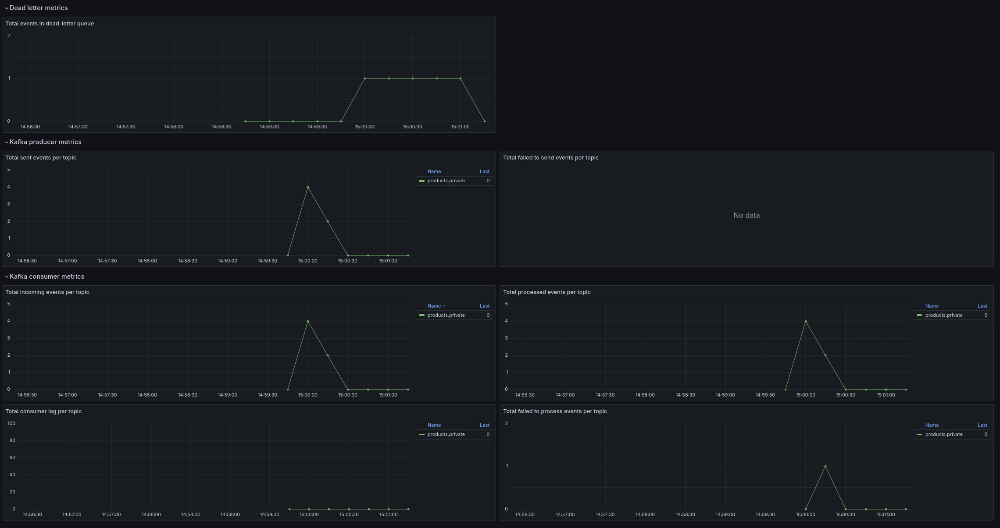

# 🧪 Fault-Tolerant Message Processing: Testing Ground

A software prototype for testing a custom architectural pattern for **resilient message processing** in distributed systems using message brokers.

> 📖 **Detailed article available on Medium:**  
> [Building Fault-Tolerant Backends with Message Brokers: My Go-To Architecture](https://medium.com/@a.e.ageev2001/building-fault-tolerant-backends-with-message-brokers-my-go-to-architecture-f559c3ed2112)

---

## 🔧 Tech Stack

- `Kotlin`, `Spring Boot`, `Quartz`, `Liquibase`
- `Kafka`, `PostgreSQL`
- `Prometheus`, `Grafana`, `ELK Stack`
- `WireMock` for mocking service failures

---

## 🧠 Pattern Concept

The project implements a retry pattern that combines ideas from the **Outbox**, **Discard, Pause and Retry**, and **Rate Limiting** patterns. The system detects retryable vs. terminal errors, handles backpressure gracefully, and allows manual or scheduled retries for failed messages.

Key features include:

1. Error classification (retryable vs. terminal)
2. Adaptive retry queue (DB or MQ-based)
3. Logarithmic retry delays
4. Threshold-based failure alerts
5. Circuit breaker logic for massive failures
6. Cron-like background retry triggering
7. Manual reprocessing via HTTP
8. Automatic recovery detection

For full algorithm explanation, see the [Medium article](https://medium.com/@a.e.ageev2001/building-fault-tolerant-backends-with-message-brokers-my-go-to-architecture-f559c3ed2112).

---

## 🧪 Implementation Use Case

The pattern is tested in a simulation of product reservation for order placement. After reserving a product, an event is sent through Kafka to trigger downstream logic. The Warehouse service (mocked with WireMock) randomly fails with 5xx responses to simulate real-world instability.



---

## 📊 Observability

A pre-configured Grafana dashboard monitors:
- Kafka producer/consumer metrics
- Retry queue size and rates
- Error spikes and throughput



---

## 🚀 Local Deployment

### Build:

```bash
./gradlew build
```

### Navigate:

```bash
cd local
```

### Run with Docker Compose:

```bash
docker-compose up --build
```

---

## 🧭 Service Endpoints

| Tool           | URL                                         |
|----------------|---------------------------------------------|
| Swagger        | http://localhost:8080/docs                  |
| Grafana        | http://localhost:3000                       |
| Prometheus     | http://localhost:9090                       |
| WireMock       | http://localhost:8443/__admin/mappings      |
| Kibana (ELK)   | http://localhost:5601/app/observability/overview |

---

## ⚙️ Filebeat Permissions Fix

Restore correct permissions:

```bash
sudo chown root:root ./filebeat/filebeat.yml
sudo chmod 644 ./filebeat/filebeat.yml
```

---

## 📚 Related

- [Medium Article – Building Fault-Tolerant Backends with Message Brokers](https://medium.com/@a.e.ageev2001/building-fault-tolerant-backends-with-message-brokers-my-go-to-architecture-f559c3ed2112)

---

Feel free to ⭐ the repo if you find the idea or architecture useful!
