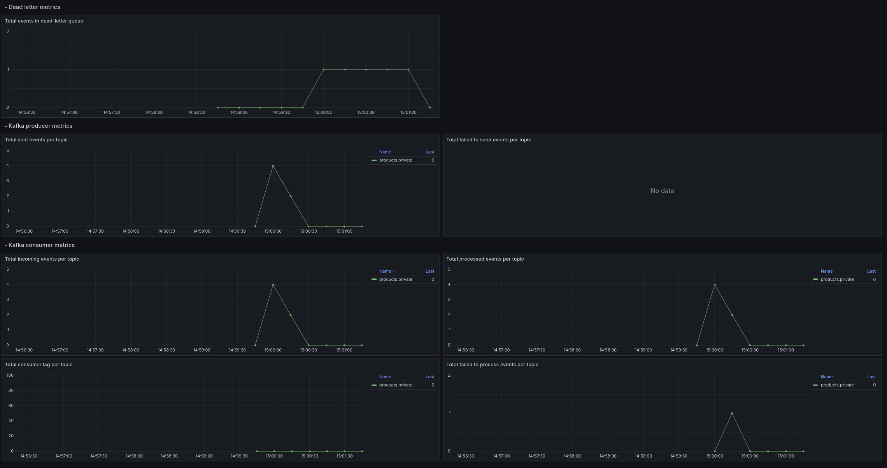

# Software testing ground for testing an architectural pattern for fault-tolerant message processing within the framework of interaction with message brokers
A project based on `Kotlin`, `Spring Boot`, `Quartz`, `Kafka`, `PostgreSQL`, `Prometheus`, `Grafana` and `Wiremock` with the ability to
customize message processing scripts and conduct load testing with pre-prepared observability

## Concept

Pattern operation algorithm:
1. If the received message is not processed successfully, the error type is determined: repeatable or terminal, i.e. allowing the external user to skip the message with the error.
2. If the error is repeatable, a constant number of repeat processing occurs, and even if an error is received during processing, the message is placed in a special queue for repeat processing, which can be a separate table in the database, or a separate queue in the `MQ`. The choice of one or another option depends on the number of requests per second, since at relatively low values, it is sufficient to use a database (`DB`), but at values over 10,000–20,000, it is recommended to choose the option with the `MQ`. The message itself will be stored as a key-value pair, where the key corresponds to the key of the received message, and the value will be its payload.
3. After adding a message to the queue, it is assigned an automatic repeat processing time. It is assumed that it will be logarithmic in nature, providing sufficient time for external developers to correct the error.
4. Simultaneously with adding to the queue, the number of messages inside the queue is checked. When a value of this metric previously determined by the developer is reached, a warning will be activated through the monitoring system for the external developer.
   The warning should not be activated immediately, since with some unstable, but short-term, network behavior, a message can get into the queue and immediately leave it after 1-2 processing repetitions, due to which so-called "flickering" warnings can be obtained.
5. Also, if the number of messages previously determined by the developer was exceeded, such as 15-20% of the average number of messages received in a certain period of time, then the message processing system will stop replenishing the queue, stop at the last received message and will process it with a constant time value until the failure ends. This is done in order to identify the case when it becomes obvious that the processing of absolutely any messages was broken, and not specifically individual ones, united by certain
   features or values, such as the presence of certain fields in the message payload. This will help reduce the unnecessary load on the use of the `DB` or `MQ`. After the failure is over, messages from the queue will be sequentially processed similarly to regular messages.
6. After adding the first message to an empty queue, an internal service will be initiated, such as a cronjob, which will check messages in the queue at a previously defined repeat time and send them for reprocessing when the time for each
   specific message is reached.
7. There is also a method for external developers to start processing manually, such as using a previously developed `HTTP` server on the web service used. This will allow you to configure event processing more flexibly, without waiting for the time for automatic retry of message processing. 8. The failure is considered complete when the number of messages in the queue reaches either 0 or less than the permissible error, as described in paragraph n. 4

## Implementation

In this project, this pattern was implemented as a service for adding, receiving and reserving a product for ordering. After reserving a product, an event about it is sent to the internal `Kafka` queue. 
Since ordering products may hypothetically require several actions at once, when using a synchronous scenario, the client may wait for a response from the server from several seconds to several minutes. 
To avoid this, an asynchronous pattern with `Kafka` was used. 
After receiving the event, the service sends a request to a certain `Warehouse` service to reserve the required product and only after a successful response commits the message in the queue, after which the business process can be considered complete (in our case, a mocked `HTTP` server, which specifically responds to some requests with a `5xx` error, thereby simulating failures).

## Observation

For observability, a board was prepared in advance in Grafana with metrics for Kafka consumers, producers and a queue for messages with errors:



## For local deploy

Build:

```bash
./gradlew build
```

In repository's directory:

```bash
cd local
```

Run:

```bash
docker-compose up --build
```

## Deploy prepared app

Run:

```bash
./gradlew bootRun
```

## After deploy

|            |                                        |
|------------|----------------------------------------|
| Swagger    | http://localhost:8080/docs             |
| Grafana    | http://localhost:3000                  |
| Prometheus | http://localhost:9090                  |
| WireMock   | http://localhost:8443/__admin/mappings |
